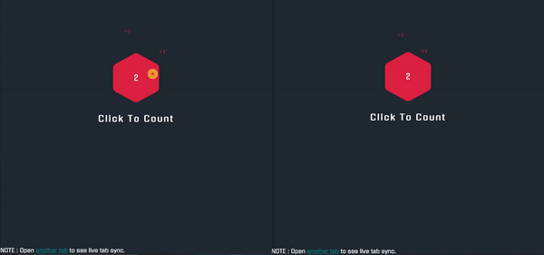

# TabSync

Tab sync as name suggest is about keeping the different tabs in the same browser in sync.

In the following demo, once the hexagon button is clicked, this triggers a function to send the totalCount data from the current tab to it's service worker and the [service worker](https://developers.google.com/web/fundamentals/primers/service-workers/) broadcasts the same to rest of the tabs open. 

Hence keeping all the tabs in sync.

Demo : [Github page](http://jhamadhav.com/tabSync/)

